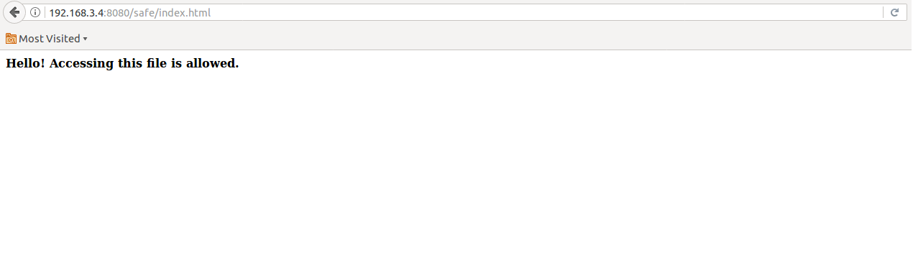
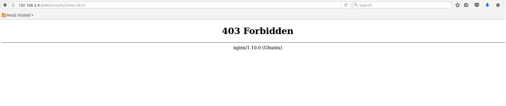

# Objectives

## Lab Overview

The Intel® IoT Gateway provides number of Security features both at hardware and software level to securely execute your IoT applications. In this lab we will go through following features:

*   Trusted Protection module (TPM)

*   Intel® Software Guard Extensions (Intel® SGX)

*   Software/OS level security on your Intel® IoT Gateway

## Software/OS security features

There are several OS level security options that can be utilized on your Intel® IoT Gateway. Ubuntu has several features like AppArmor, home folder encryption during installation, firewalls etc. to protect your content. There are also tools like CryFS to encrypt specific folders

In this lab we will look at some software/OS level tools/option available to secure your IoT applications running on the gateway

## Folder encryption using CryFS

CryFS is an application that allows you to create encrypted directories, any file that is placed in such a directory will be encrypted. To open an encrypted directory you need a correct password.

It is one of several utilities/options available on Ubuntu for encrypting your content. Follow below steps to set up CryFS on your Intel® IoT Gateway

*   Open a ssh terminal to your device and type:

```bash
        wget -O - https://www.cryfs.org/install.sh | sudo bash
```

*   You are now ready to create encrypted directory. The application CryFS will create one directory which contains the encrypted files and one directory where the files are unlocked and accessible. The syntax for CryFS is: "CryFS {path to encrypted directory} {path to visible directory}"

    For example, If you wish to have a directory in home directory called visible and another one called encrypted:

```bash

cryfs ~/.encrypted ~/visible

```

* First CryFS will ask you to create the selected directories. Simply type 'y'. Then it asks which degree of encryption that should be used, simply press enter to use default encryption-level. At last CryFS will ask you for the password that is needed to reach the encrypted information.

*  If all goes well and there is no error you can start creating content in this directory

*   Let's create a sample file in the directory. For e.g. we create one file here myfile and save it

```bash
vi ~/visible/myfile
```

* Save the file with a ":wq" command in vi editor

*   In order to close the ~/visible directory simply type:

```bash
fusermount -u ~/visible
```
* As long as the directory is closed all the information in ~/visible will seem to have disappeared. The only way to gain access to this information again is by unlocking it

*  Now if you browse to directory ~/visible you will not see myfile there.

*   To unlock the directory and have access to content, again type the following command

```bash
cryfs ~/.encrypted ~/visible
```

* Give the password for the directory and then you should see the content of the directory, in our case myfile will be now visible

*   It is also possible to automatically mount the directory at login in a secure way

## OS Security feature: AppArmor

AppArmor is a Mandatory Access Control (MAC) system which is a kernel (LSM) enhancement to confine programs to a limited set of resources. AppArmor's security model is to bind access control attributes to programs rather than to users. AppArmor confinement is provided via profiles loaded into the kernel, typically on boot. AppArmor profiles can be in one of two modes: **enforcement** and **complain**. Profiles loaded in enforcement mode will result in enforcement of the policy defined in the profile as well as reporting policy violation attempts (either via syslog or auditd). Profiles in complain mode will not enforce policy but instead report policy violation attempts.

As an example we will create a simple AppArmor security profile, which is a text file containing permission details for Nginx, a popular HTTP server

For the sake of demonstrating how AppArmor works, we will configure Nginx to serve static files from two directories: **/data/www/safe** and **/data/www/unsafe**, and configure AppArmor to confine Nginx to /data/www/safe. With this setup, when AppArmor is inactive, an external user will be able to access files from both directories. When AppArmor is active, the user will be able to access only the files in /data/www/safe.

## Install Nginx

Install Nginx with following command
```bash
sudo apt-get install nginx
```

Your Nginx server is now operational. The default server will be running on port 80\. You can test it in a browser by visiting your IP address as the URL: http://gateway-IP:80. You should see the default Nginx welcome page.

## Configure Nginx to Serve Static Files



Create the directories from which the static files will be served.
``bash
sudo mkdir -p /data/www/safe
sudo mkdir -p /data/www/unsafe
```

Add a file to the safe directory using nano:

```bash
sudo nano /data/www/safe/index.html
```

Let the file have the following contents:
**Hello! Accessing this file is allowed.**

Similarly, create another file in **/data/www/unsafe** named **index.html**, with the following contents:

**Hello! Accessing this file is NOT allowed.**

Nginx's configuration file is located at /etc/nginx/nginx.conf. Edit this file to create a new server that listens on port **8080** and serves files from /data/www. Ignoring the commented lines, after editing, your file should look like the file shown below. You will need to add a hash mark to comment out the include **/etc/nginx/sites-enabled/***; line. You will also need to add the entire server block shown below:

```
user www-data;
worker_processes auto;
pid /run/nginx.pid;

events {
        worker_connections 768;
        # multi_accept on;
}
http {

        ##
        # Basic Settings
        ##

        sendfile on;
        tcp_nopush on;
        tcp_nodelay on;
        keepalive_timeout 65;
        types_hash_max_size 2048;
        # server_tokens off;

        # server_names_hash_bucket_size 64;
        # server_name_in_redirect off;

        include /etc/nginx/mime.types;
        default_type application/octet-stream;

        ##
        # SSL Settings
        ##

        ssl_protocols TLSv1 TLSv1.1 TLSv1.2; # Dropping SSLv3, ref: POODLE
        ssl_prefer_server_ciphers on;

        ##
        # Logging Settings
        ##

        access_log /var/log/nginx/access.log;
        error_log /var/log/nginx/error.log;

        ##
        # Gzip Settings
        ##

        gzip on;
        gzip_disable "msie6";
        # gzip_vary on;
        # gzip_proxied any;
        # gzip_comp_level 6;
        # gzip_buffers 16 8k;
        # gzip_http_version 1.1;
        # gzip_types text/plain text/css application/json application/javascript text/xml application/xml application/xml+rss text/javascript;

        ##
        # Virtual Host Configs
        ##

        include /etc/nginx/conf.d/*.conf;
        #include /etc/nginx/sites-enabled/*;

        server {
                listen 8080;
                location / {
                        root /data/www;
                }
        }
}
```

Save your changes, and load the new configuration by executing the following command:
```bash
sudo nginx -s reload
```

At this point, since AppArmor has not yet been turned on for Nginx, you should be able to visit both **http://gateway-IP:8080/safe/index.html** and **http://gateway-IP:8080/unsafe/index.html.** The safe page should say: **"Hello! Accessing this file is allowed."** as shown in figure


## Create a new AppArmor profile for Nginx

List all available profiles by executing this command:
```bash
sudo apparmor_status
```

You should see quite a few profiles. Some will be in enforce mode, and some in complain mode. When an application's profile is in complain mode, AppArmor logs the activities of the application without restricting it in any manner. Once there's something to log, you'll find the log files for the Nginx server in the /var/log/nginx directory. AppArmor restricts what an application can do only when its profile is in enforce mode. There is no profile present for the Nginx server. We'll create one in the next step.

Install Apparmor utils with following command:
```bash
sudo apt-get install apparmor-utils
```

You are now ready to start profiling the activities of Nginx. Use the **aa-autodep** command to create a new blank profile. The profile will be created in **/etc/apparmor.d.**
```bash
cd /etc/apparmor.d/
sudo aa-autodep nginx
```

Once the profile is created, use aa-complain to put the profile in complain mode.
```bash
sudo aa-complain nginx
```
Restart Nginx.

```bash
sudo service nginx restart
```

Open a browser, and visit http://gateway-IP:8080/safe/index.html. This will trigger the normal entries for accessing the safe website to appear in your Nginx logs. Go back to the terminal. Now we'll use an AppArmor utility to go through the Nginx logs and approve or disapprove each action it finds there.

```bash
sudo aa-logprof
```

This command scans the log files and updates the AppArmor Nginx profile. You will be prompted several times to allow or deny a capability. Assuming your server is not under an attack currently, you can press **A** every time, since all the capabilities requested are necessary for Nginx to work correctly. Finally, when prompted to save the changes, press **S**.

This general process for enabling AppArmor for a new application is as follows:

*   Create a new blank profile for the application
*   Put it into complain mode
*   Take normal actions with the application so appropriate entries get added to the logs
*   Run the AppArmor utility to go through the logs and approve or disapprove various application actions

## Edit AppArmor Nginx Profile

For Nginx specifically, you will need to make some changes to the auto-generated file for it to work properly. Open the **/etc/apparmor.d/usr.sbin.nginx** file for editing.

```bash
sudo nano /etc/apparmor.d/usr.sbin.nginx
```

You should make at least the following changes:

*   Add the #include <abstractions/apache2-common> line - yes, the hash mark is intentional
*   Add the capability setgid line
*   Add the capability setuid line
*   Update the /data/www/safe/ line to include the entire directory with an asterisk (*)
*   Add the deny /data/www/unsafe/* r, line, including the comma
*   Make sure Nginx can write to the error log by setting w for /var/log/nginx/error.log

The apache2-common include lets Nginx listen on various ports. The new capability lines allow Nginx to start new processes. The deny rule allows us to block Nginx from accessing the /data/www/unsafe/ directory.

One working profile looks like this:


```
#include <tunables/global>

/usr/sbin/nginx {
 #include <abstractions/apache2-common>
 #include <abstractions/base>
 #include <abstractions/lxc/container-base>

 capability setuid,
 capability setgid,

 /data/www/safe/* r,
 deny /data/www/unsafe/* r,
 /etc/group r,
 /etc/nginx/conf.d/ r,
 /etc/nginx/mime.types r,
 /etc/nginx/nginx.conf r,
 /etc/nsswitch.conf r,
 /etc/passwd r,
 /etc/ssl/openssl.cnf r,
 /usr/sbin/nginx mr,
 /var/log/nginx/error.log w,
}
```

Your profile might look a bit different, since it was generated based on your log file

The AppArmor Nginx profile is now ready. Use the aa-enforce to put the profile in enforce mode.
```bash
sudo aa-enforce nginx
```

It is recommended that you reload all profiles and restart Nginx to be sure that the latest changes are in effect. Type in the following:

```bash
sudo /etc/init.d/apparmor reload
sudo service nginx restart
```

## Check AppArmor status for Nginx


Check AppArmor's status:
```bash
sudo apparmor_status
```

You should see Nginx processes running in enforce mode.

Go back to the browser and visit **http://gateway-IP:8080/safe/index.html**. You should be able to see the page. Then visit **http://gateway-IP:8080/unsafe/index.html** You should see an error page like the one shown in figure. This proves that our profile is working as expected.

## References

*   [https://www.openssl.org/](https://www.openssl.org/)

    [Trusted Platform Technology](http://www.intel.com/content/dam/support/us/en/documents/motherboards/server/sb/g21682003_tpm_hwug.pdf)
