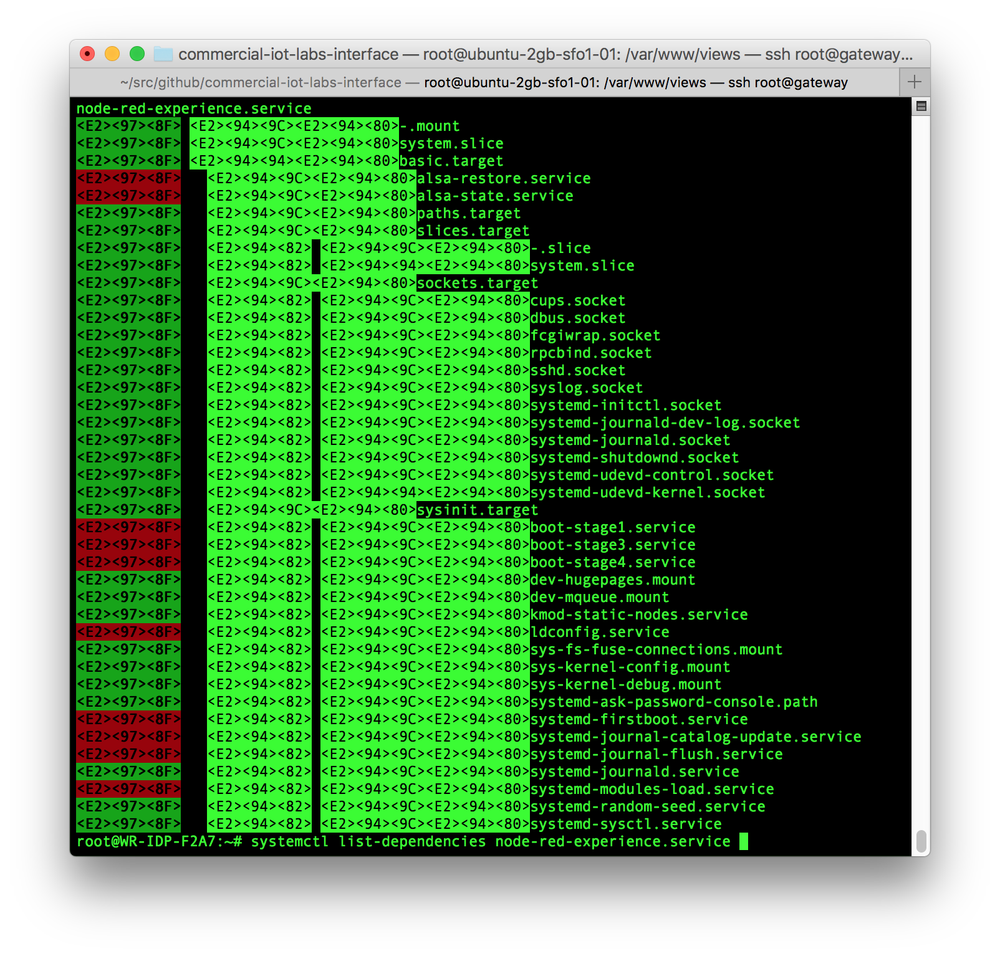

# Managing Systemd Services and Units

## Introduction to Service Management


Ubuntu uses Systemd to manage the Intel® IoT Gateway system services. Systemd is a widely used in the Linux community and understanding how it works is essential for securing your gateway for deployment.

In this lab, you will be using the systemctl command, which is the administrative command line tool for controlling the init system. You will cover how to disable unused services, check statuses, change system states, and modify configuration files.

Systemd labels services that it controls as "units". A unit configuration file that describes how to manage a system resource. Systemd defines a number of types of services. In this lab, you will be managing services with the aim of reducing the attack surface of your gateway.

## Starting and Stopping Services


To start a service use the **start** command. You will need to be the root user or use the sudo command.

Try starting the **node-red-experience**
```bash
sudo systemctl start node-red-experience.service
```
or you can simply drop the **.service** and type:
```bash
sudo systemctl start node-red-experience
```
Try stopping the **node-red-experience**

Likewise, you can stop a system service by typing:
```bash
sudo systemctl stop node-red-experience
```

## Restarting and Reloading


Restarting a currently running service is simple with the **restart** command. This will terminate the process and then relaunch it.
```bash
sudo systemctl restart node-red-experience
```

If the service is able to reload its configuration files without terminating first, then you can use the **reload** command.

```bash
sudo systemctl reload node-red-experience
```

If you are unsure whether the service is able to reload its own configuration files, you can use the **reload-or-restart** command. This will reload the configuration if possbile. Otherwise, it will restart the service.

```bash
sudo systemctl reload-or-restart node-red-experience
```

You can check the status of your service **node-red-experience** with following command, it will display current status as shown in figure.

```bash
sudo systemctl status node-red-experience
```

## Enabling and Disabling Services


Enabling and disabling refers to whether a service is started at boot (enabled) or not (disabled).

If you want a service to start when the system next boots type the follow:

```bash
sudo systemctl enable node-red-experience
```

To make sure that the system does not start a service at boot, type the following:
```bash
sudo systemctl disable node-red-experience
```

```bash
Checking the Status of Services
```


The **status** command will report whether the service is running or not and if there is a failure condition.

Let's see if what the current status is of the **node-red-experience**.

```bash
sudo systemctl status node-red-experience
```

There are functions which determine the current status of a service
```bash
sudo systemctl is-active node-red-experience
```

This will return the current unit state, which is usually active or inactive. The exit code will be "0" if it is active, making the result simpler to parse programatically.

```bash
    sudo systemctl is-enabled node-red-experience
    sudo systemctl is-failed node-red-experience
```

## System State Overview


The next set of commands will help to determine the state of the entire system.
```bash
sudo systemctl list-units
```

This command will show you a list of all of the units on the system whether they are active or not.
```bash
sudo systemctl list-units --all
```

The output has the following columns:

*   **UNIT**: The name of the systemd
*   **LOAD**: This value is true if systemd parse the configuration files for this unit
*   **ACTIVE**: A summary state about whether the unit is active.
*   **SUB**: This is a level state that indicates more detailed information about the unit. This often varies by unit type, state, and the actual method in which the unit runs.
*   **DESCRIPTION**: A short description of the unit.

You can also display all units in the inactive state
```bash
sudo systemctl list-units --all --state=inactive
```
Lastly, it's very useful to filter the results to include only the **service** type.
```bash
sudo systemctl list-units --type=service
```

## Unit Management - Displaying a Unit File


The cat command will display the unit file that was used to configure a given process.
```bash
sudo systemctl cat node-red-experience.service
```

## Displaying Dependencies


To display the heirarchy of units that must successfully become active before a given unit can run.
```bash
sudo systemctl list-dependencies node-red-experience.service
```
To show the units that list a given unit as a dependency type:

```bash
    sudo systemctl list-dependencies --reverse node-red-experience.service
    sudo systemctl show node-red-experience.service -p Conflicts
```

## Masking and Unmasking Units


Earlier we showed you how to stop a service. Systemd has another mechanism for stopping a service from running called **masking**. When masking a service systemd creates a symlink between the service's configuration files in /etc/systemd/ and /dev/null. This stops the service from being triggered as a dependency of another service. It also prevents the service from being activated manually.
```bash
sudo systemctl mask nginx
```

You can see a list of masked units by typing the following:
```bash
sudo systemctl list-unit-files
```
To unmask the service so that it is enabled again type the following

```bash
sudo systemctl unmask nginx
```
You can see that this service is enable again when you check the list
```bash
sudo systemctl list-unit-files
```

## References

*   [https://www.openssl.org/](https://www.openssl.org/)

    [Trusted Platform Technology](http://www.intel.com/content/dam/support/us/en/documents/motherboards/server/sb/g21682003_tpm_hwug.pdf)
